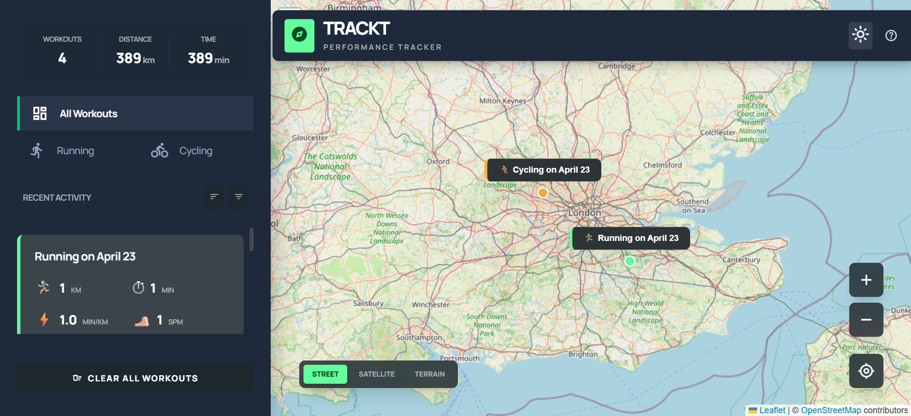

# Trackt 🗺️

> Map and track your running & cycling workouts in real time.



---

## Features

- 🏃 Log running & cycling workouts by clicking on the map
- ✏️ Edit existing workouts
- 🗑️ Delete individual workouts or clear all
- 📊 Live stats panel — total workouts, distance & time
- 🔃 Sort by distance or duration (ascending/descending)
- 🗂️ Filter by type (All / Running / Cycling)
- 📅 Filter by date (Newest / Oldest)
- 🗺️ Map layer toggle — Street, Satellite, Terrain
- 🔍 Zoom in/out + My Location button
- 🌙 Dark / Light theme toggle with persistence
- 💾 Full localStorage persistence (workouts + theme + map layer)
- 📌 Custom animated map pins with color-coded markers

---

## Tech Stack

- Vanilla JavaScript (OOP + EventBus Architecture)
- Leaflet.js
- Tailwind CSS
- HTML5 Geolocation API
- localStorage

---

## Architecture

Built with a clean class-based structure — no frameworks, no bundlers.

```
src/
├── App.js                  ← Bootstraps everything
├── core/
│   ├── EventBus.js         ← Decouples all classes (Radio Station pattern)
│   └── WorkoutManager.js   ← The brain — coordinates everything
├── models/
│   ├── Workout.js          ← Base class
│   ├── Running.js          ← Extends Workout
│   └── Cycling.js          ← Extends Workout
└── services/
    ├── WorkoutStore.js     ← localStorage only
    ├── MapManager.js       ← Leaflet map, markers, layers
    ├── UIManager.js        ← DOM rendering, form, sidebar
    ├── WorkoutService.js   ← Stats calculations
    └── Formatter.js        ← Number formatting
```

### EventBus Pattern

No class talks directly to another. They communicate through events:

```
MapManager    →  emits  'map:click'
UIManager     →  listens, shows form
UIManager     →  emits  'form:submit'
WorkoutManager → listens, creates workout
WorkoutManager → emits  'workout:created'
UIManager     →  listens, renders card
MapManager    →  listens, pins marker
```

---

## Run Locally

Open with **Live Server** in VS Code (required for ES Modules).

No build step needed.

---

## Credits

Map data © [OpenStreetMap](https://www.openstreetmap.org/) contributors  
Satellite imagery © [Esri](https://www.esri.com)  
Terrain © [OpenTopoMap](https://opentopomap.org)
